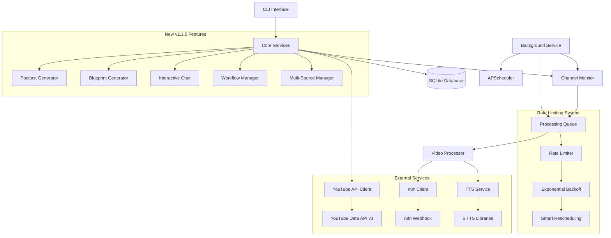

# 🎙️ YouTube Chat CLI - Professional Podcast Generation Platform

[](https://python.org)
[](LICENSE)
[](https://github.com/usemanusai/youtube-free-deep-research-cli)
[](https://github.com/usemanusai/youtube-free-deep-research-cli/releases)

**AI-powered CLI tool for YouTube video analysis, channel monitoring, and automated content processing with intelligent rate limiting and n8n RAG workflow integration.**

YouTube Chat CLI is a comprehensive solution for researchers, content creators, and knowledge workers who need to efficiently analyze, monitor, and interact with YouTube content at scale while respecting platform limitations through intelligent rate limiting. Now enhanced with professional podcast generation, multi-source processing, blueprint creation, and interactive chat capabilities.

## ✨ Features

### 🎙️ **Advanced Podcast Generation (NEW in v2.1.0)**
- **14 Professional Podcast Styles**: Interview, Debate, News Report, Educational, Storytelling, Panel Discussion, Documentary, Quick Tips, Deep Dive, Roundup, and more
- **Multi-Voice Support**: Different speakers for different roles (host, expert, moderator, panelists)
- **Customizable Length & Tone**: Short (2-8 min) to Extended (30+ min) with 8 different tone options
- **Intelligent Content Synthesis**: AI-powered script generation with n8n RAG integration

### 📚 **Multi-Source Content Processing (NEW in v2.1.0)**
- **20+ File Types**: PDF, DOCX, TXT, MD, CSV, XLSX, MP3, WAV, MP4, AVI, URLs, YouTube videos/playlists/channels, PPTX, code files, images (OCR)
- **Advanced Filtering**: Date range, file type, size, tags, location-based filtering
- **Batch Processing**: Handle hundreds of sources efficiently with parallel processing
- **Smart Content Prioritization**: AI selects most relevant content automatically

### 📋 **Blueprint Generation (NEW in v2.1.0)**
- **5 Blueprint Styles**: Comprehensive, Executive, Technical, Educational, Reference
- **Multiple Output Formats**: Markdown, PDF, HTML, DOCX, JSON
- **Intelligent Documentation**: AI-powered synthesis from multiple sources
- **Structured Output**: Table of contents, citations, metadata, and professional formatting

### 🤖 **Interactive Chat Interface (NEW in v2.1.0)**
- **Rich Terminal UI**: Beautiful formatting with syntax highlighting, tables, and markdown rendering
- **Session Management**: Save, load, resume conversations with full history
- **Real-time Streaming**: Live responses from n8n RAG workflows
- **Export Capabilities**: JSON and Markdown export of chat sessions

### 🔄 **Workflow Management (NEW in v2.1.0)**
- **Multiple n8n Workflows**: Manage different RAG workflows for various use cases
- **Connection Testing**: Automated workflow health checks
- **Default Workflow**: Set preferred workflows for different tasks
- **Import/Export**: Backup and share workflow configurations

### YouTube Integration
- **Interactive chat** with YouTube video transcripts using advanced AI models
- **Automated channel monitoring** with configurable intervals (daily, weekly, custom)
- **Bulk import** from channels, playlists, and URL files with comprehensive filtering
- **Advanced filtering** by duration, keywords, view count, exclude shorts/live streams
- **Video metadata extraction** and persistent storage with SQLite database
- **Intelligent transcript processing** with punctuation restoration and formatting

### Text-to-Speech (TTS)
- **Support for 6 TTS libraries**: Kokoro, OpenVoice v2, MeloTTS, Chatterbox, Edge TTS, Google TTS
- **Automated installer** with CPU-only support for compatibility
- **Configurable voice selection** and audio settings per library
- **Retry logic and timeout handling** for robust audio generation
- **Podcast-style audio overviews** with natural speech patterns

### Intelligent Rate Limiting
- **Smart queue system** to prevent YouTube IP blocking and API quota exhaustion
- **Maximum 5 videos per day** processing limit (configurable)
- **1-2 hour delays** between video processing attempts with smart distribution
- **Exponential backoff** on rate limit detection (2+ hour delays)
- **Distributed processing** throughout the day instead of bulk operations
- **Automatic rescheduling** of failed videos with intelligent retry logic

### Background Service
- **Automated channel monitoring** with APScheduler for cross-platform scheduling
- **Daily video discovery scans** at configurable times (default: 8 AM)
- **Continuous queue processing** every 2 hours respecting rate limits
- **Health checks and stuck job detection** every 30 minutes
- **Persistent state** across system restarts with PID file management
- **Comprehensive logging** with rotation and configurable levels

### n8n RAG Workflow Integration
- **Automatic forwarding** of video data (metadata + transcripts) to n8n webhooks
- **Structured payload format** with comprehensive video information
- **Retry logic with exponential backoff** (3 retries, 2-second base delay)
- **Configurable webhook URLs** and API keys for authentication
- **Graceful fallback** with mock responses when n8n server unavailable

### Data Management
- **SQLite database** for channels, videos, import jobs, and processing queue
- **Comprehensive statistics** and analytics with success rate tracking
- **Import history tracking** with detailed job status and progress monitoring
- **Video processing state management** (pending, processing, completed, failed)
- **Automatic cleanup** of old queue entries and database optimization

## 📋 Table of Contents

- [🏗️ Architecture Overview](#️-architecture-overview)
- [📋 Prerequisites](#-prerequisites)
- [🚀 Installation](#-installation)
- [⚙️ Configuration](#️-configuration)
- [📖 Usage](#-usage)
- [🎙️ New Podcast Features](#️-new-podcast-features)
- [📚 Multi-Source Processing](#-multi-source-processing)
- [📋 Blueprint Generation](#-blueprint-generation)
- [🤖 Interactive Chat](#-interactive-chat)
- [🔄 Workflow Management](#-workflow-management)
- [🔄 System Architecture Diagrams](#-system-architecture-diagrams)
- [🛡️ Rate Limiting & Queue System](#️-rate-limiting--queue-system)
- [📚 API Reference](#-api-reference)
- [🐛 Troubleshooting](#-troubleshooting)
- [🛠️ Development](#️-development)
- [📄 License](#-license)
- [📝 Changelog](#-changelog)
- [🙏 Acknowledgments](#-acknowledgments)

## 🏗️ Architecture Overview

YouTube Chat CLI follows a professional, modular architecture with clear separation of concerns:



## 📋 Prerequisites

- **Python 3.8+** (tested on 3.8, 3.9, 3.10, 3.11, 3.12)
- **YouTube Data API v3 key** - [Get from Google Cloud Console](https://console.cloud.google.com/apis/credentials)
- **OpenRouter API key** (optional, for AI features) - [Get from OpenRouter](https://openrouter.ai/keys)
- **n8n webhook URL** (optional, for RAG integration) - Your n8n server webhook endpoint

### System Requirements
- **Operating System**: Linux, macOS, Windows
- **Disk Space**: 2GB minimum (for TTS libraries and database)
- **Memory**: 4GB RAM recommended (2GB minimum)
- **Network**: Stable internet connection for API calls

## 🚀 Installation

### Step-by-step Installation Guide

```bash
# 1. Clone the repository
git clone https://github.com/usemanusai/youtube-free-deep-research-cli.git
cd youtube-free-deep-research-cli

# 2. Create virtual environment (recommended)
python -m venv venv
source venv/bin/activate  # On Windows: venv\Scripts\activate

# 3. Install the package
pip install -e .

# 4. Install dependencies
pip install -r requirements.txt

# 5. Configure environment variables
cp .env.template .env
# Edit .env and add your API keys

# 6. Install TTS libraries (optional)
youtube-chat tts install-all --cpu-only
```

### Alternative Installation Methods

**Using the installation script:**
```bash
chmod +x scripts/install_dependencies.sh
./scripts/install_dependencies.sh
```

**Direct pip installation (when published):**
```bash
pip install youtube-chat-cli
```

**Using Docker:**
```bash
docker pull usemanusai/youtube-chat-cli:latest
docker run -it --env-file .env usemanusai/youtube-chat-cli
```

### Verify Installation

```bash
# Test CLI access
youtube-chat --help
python cli.py --help  # Backward compatibility

# Test core functionality
youtube-chat stats
youtube-chat tts list
```

## 📖 Usage

### Basic Chat

```bash
# Chat with a YouTube video
youtube-chat https://www.youtube.com/watch?v=VIDEO_ID

# Set source and start interactive chat
youtube-chat set-source "https://www.youtube.com/watch?v=VIDEO_ID"
youtube-chat chat

# Generate content analysis
youtube-chat summarize
youtube-chat faq
youtube-chat toc
```

### NEW: Enhanced Podcast Generation (v2.1.0)

```bash
# Generate a summary podcast from YouTube video
youtube-chat podcast https://www.youtube.com/watch?v=VIDEO_ID

# Generate an interview-style podcast with custom voice
youtube-chat podcast --style interview --voice en-US-JennyNeural --length long VIDEO_URL

# Generate a multi-source podcast from documents
youtube-chat podcast-create-multi --sources /path/to/documents --style roundup --length medium

# Create debate-style podcast with professional tone
youtube-chat podcast --style debate --length extended --tone professional VIDEO_URL
```

### NEW: Interactive Chat (v2.1.0)

```bash
# Start interactive chat with n8n RAG
youtube-chat chat

# Resume specific session
youtube-chat chat --session my-research-session

# Ask a one-off question
youtube-chat ask "What are the main insights from recent videos?"
```

### NEW: Blueprint Generation (v2.1.0)

```bash
# Create comprehensive documentation from sources
youtube-chat blueprint-create --sources /path/to/research --title "Research Analysis" --style comprehensive

# Generate executive summary
youtube-chat blueprint-create --sources /path/to/reports --title "Q4 Summary" --style executive --format pdf
```

### TTS Management

```bash
# List available TTS libraries
youtube-chat tts list

# Install all TTS libraries (CPU-only for compatibility)
youtube-chat tts install-all --cpu-only

# Install specific library
youtube-chat tts install kokoro --cpu-only --retry-count 3 --timeout 300

# Configure TTS settings
youtube-chat tts configure

# Generate audio overview
youtube-chat podcast --voice "en-US-AriaNeural" --library edge-tts
```

### Channel Monitoring

```bash
# Add channel for monitoring with filters
youtube-chat channel add https://www.youtube.com/@channelname \
  --check-interval 24 \
  --no-shorts \
  --no-live \
  --include-keywords "AI,machine learning" \
  --min-duration 300

# List all monitored channels
youtube-chat channel list

# Update channel settings
youtube-chat channel update CHANNEL_ID --check-interval 12 --active

# Scan channels for new videos
youtube-chat channel scan --all
youtube-chat channel scan --channel-id CHANNEL_ID --force

# Remove channel from monitoring
youtube-chat channel remove CHANNEL_ID
```

### Bulk Import

```bash
# Import from channel (dry run first)
youtube-chat import channel https://www.youtube.com/@channelname \
  --limit 50 \
  --date-from 2025-01-01 \
  --date-to 2025-12-31 \
  --dry-run

# Import from channel (actual import)
youtube-chat import channel https://www.youtube.com/@channelname \
  --limit 50 \
  --include-keywords "tutorial,guide" \
  --exclude-keywords "shorts,live" \
  --min-duration 300 \
  --no-shorts

# Import from playlist
youtube-chat import playlist https://www.youtube.com/playlist?list=PLAYLIST_ID \
  --limit 25 \
  --dry-run

# Import from file containing URLs
youtube-chat import file video_urls.txt \
  --include-keywords "python,programming" \
  --no-shorts
```

### NEW: Workflow Management (v2.1.0)

```bash
# Add new workflow
youtube-chat workflow add \
  --name "research-workflow" \
  --url "http://localhost:5678/workflow/ABC123" \
  --description "Research-focused RAG workflow"

# List all workflows
youtube-chat workflow list

# Test workflow connection
youtube-chat workflow test research-workflow

# Set default workflow
youtube-chat workflow set-default research-workflow
```

### n8n Integration

```bash
# Configure n8n webhook
youtube-chat n8n configure http://localhost:5678/workflow/vTN9y2dLXqTiDfPT \
  --api-key your_api_key

# Manually send specific video to n8n
youtube-chat n8n send VIDEO_ID

# Test n8n connection
youtube-chat verify-connections
```

### Background Service

```bash
# Start background service (daemon mode)
youtube-chat service start --daemon

# Check service status
youtube-chat service status

# View service logs
youtube-chat service logs --lines 50

# Stop background service
youtube-chat service stop
```

### Statistics & History

```bash
# View comprehensive statistics
youtube-chat stats

# View import history
youtube-chat history --limit 20

# View channel-specific history
youtube-chat history --channel-id CHANNEL_ID --limit 10

# View session history
youtube-chat session list
youtube-chat session load SESSION_ID
```

## ⚙️ Configuration

### Environment Variables (.env file)

Create a `.env` file with the following configuration:

```bash
# Required: YouTube Data API v3 key
YOUTUBE_API_KEY=your_youtube_api_key_here

# Optional: OpenRouter API key for AI features
OPENROUTER_API_KEY=your_openrouter_key_here

# Optional: n8n webhook URL for RAG integration
N8N_WEBHOOK_URL=http://localhost:5678/workflow/vTN9y2dLXqTiDfPT

# Optional: MaryTTS server URL for advanced TTS
MARYTTS_SERVER_URL=http://localhost:59125

# TTS Configuration (NEW in v2.1.0)
DEFAULT_TTS_VOICE="en-US-AriaNeural"
DEFAULT_TTS_LIBRARY="edge-tts"

# Podcast Generation Settings (NEW in v2.1.0)
DEFAULT_PODCAST_STYLE="summary"
DEFAULT_PODCAST_LENGTH="medium"
DEFAULT_PODCAST_TONE="professional"
ENABLE_RAG_BY_DEFAULT=true
```

### Rate Limiting Settings

```bash
# Maximum videos to process daily (default: 5)
MAX_VIDEOS_PER_DAY=5

# Minimum delay between videos in hours (default: 1)
MIN_DELAY_HOURS=1

# Maximum delay between videos in hours (default: 2)
MAX_DELAY_HOURS=2

# Backoff duration on rate limit in hours (default: 2)
BACKOFF_HOURS=2
```

### Channel Monitoring Settings

Configure default behavior for channel monitoring:

- **Check interval**: Hours between channel scans (default: 24)
- **Filters**: Default filters applied to all channels
  - `no_shorts`: Exclude YouTube Shorts (videos < 60 seconds)
  - `no_live`: Exclude live streams
  - `min_duration`: Minimum video duration in seconds
  - `max_duration`: Maximum video duration in seconds
  - `include_keywords`: Only include videos with these keywords
  - `exclude_keywords`: Exclude videos with these keywords

### Getting API Keys

1. **YouTube Data API v3**:
   - Go to [Google Cloud Console](https://console.cloud.google.com/apis/credentials)
   - Create a new project or select existing
   - Enable YouTube Data API v3
   - Create credentials (API Key)

2. **OpenRouter API** (Optional):
   - Visit [OpenRouter](https://openrouter.ai/keys)
   - Sign up and generate an API key
   - Provides access to multiple AI models

## 🎙️ New Podcast Features (v2.1.0)

### Available Styles

| Style | Description | Length Range | Voice Roles | Best For |
|-------|-------------|--------------|-------------|----------|
| **Summary** | Quick overview of main points | 3-30 min | Narrator | Daily updates, quick insights |
| **Interview** | Conversational host-expert format | 5-45 min | Host + Expert | Educational content, expert insights |
| **Debate** | Multiple perspectives discussion | 7-60 min | Moderator + Advocates | Controversial topics, analysis |
| **News Report** | Journalistic coverage style | 4-36 min | Anchor + Reporter | Current events, breaking news |
| **Educational** | Teaching-focused presentation | 6-54 min | Instructor | Learning content, tutorials |
| **Storytelling** | Narrative-driven content | 7-63 min | Narrator | Case studies, stories |
| **Panel** | Multiple speakers discussion | 8-72 min | Moderator + Panelists | Roundtable discussions |
| **Documentary** | In-depth investigative format | 10-90 min | Documentary narrator | Deep investigations |
| **Quick Tips** | Short, actionable advice | 2-18 min | Tips host | How-to content |
| **Deep Dive** | Extended technical analysis | 15-120 min | Technical analyst | Technical content, research |
| **Roundup** | Compilation of multiple sources | 8-72 min | Roundup host | Weekly summaries |

### Usage Examples

```bash
# Interview style with custom settings
youtube-chat podcast --style interview --length long --tone conversational VIDEO_URL

# News report with professional tone
youtube-chat podcast --style news_report --length medium --tone professional VIDEO_URL

# Quick tips with enthusiastic delivery
youtube-chat podcast --style quick_tips --length short --tone enthusiastic VIDEO_URL
```

## 📚 Multi-Source Processing

### Supported File Types

#### Documents
- **PDF**: Research papers, reports, books
- **DOCX/DOC**: Word documents, articles
- **TXT**: Plain text files, notes
- **MD**: Markdown documentation
- **RTF**: Rich text format files

#### Spreadsheets & Data
- **CSV**: Data files, lists
- **XLSX/XLS**: Excel spreadsheets
- **ODS**: OpenDocument spreadsheets

#### Media Files
- **Audio**: MP3, WAV, M4A, FLAC, OGG (with transcription)
- **Video**: MP4, AVI, MOV, MKV, WebM (with transcription)

#### Web & Online Content
- **URLs**: Website scraping and analysis
- **HTML**: Local HTML files
- **YouTube**: Videos, playlists, channels

#### Presentations & Code
- **PPTX/PPT**: PowerPoint presentations
- **Code Files**: PY, JS, JSON, YAML, XML
- **Images**: PNG, JPG (with OCR text extraction)

### Multi-Source Commands

```bash
# Process entire directory
youtube-chat podcast-create-multi --sources /path/to/documents --style roundup

# Filter by file types and date
youtube-chat podcast-create-multi \
  --sources /path/to/content \
  --file-types pdf,docx,md \
  --days 30 \
  --style comprehensive

# Create from mixed sources
youtube-chat podcast-create-multi \
  --sources /path/to/research \
  --title "Research Roundup" \
  --style deep_dive \
  --length extended \
  --use-rag
```

## 📋 Blueprint Generation

Create comprehensive documentation from multiple sources with AI-powered synthesis.

### Blueprint Styles

| Style | Purpose | Sections | Best For |
|-------|---------|----------|----------|
| **Comprehensive** | Complete documentation | Executive summary, overview, findings, analysis, recommendations | Project documentation |
| **Executive** | High-level summary | Executive summary, key points, implications, next steps | Leadership presentations |
| **Technical** | Technical documentation | Overview, architecture, implementation, best practices | Technical docs |
| **Educational** | Learning materials | Objectives, concepts, guide, examples, exercises | Training materials |
| **Reference** | Quick reference | Commands, configuration, troubleshooting, FAQ | Reference guides |

### Blueprint Commands

```bash
# Create comprehensive blueprint
youtube-chat blueprint-create \
  --sources /path/to/research \
  --title "Research Analysis" \
  --style comprehensive \
  --format pdf

# Executive summary from recent files
youtube-chat blueprint-create \
  --sources /path/to/reports \
  --title "Q4 Summary" \
  --style executive \
  --days 90 \
  --use-rag

# Technical documentation
youtube-chat blueprint-create \
  --sources /path/to/code \
  --title "API Documentation" \
  --style technical \
  --format html
```

## 🤖 Interactive Chat

Rich terminal-based chat interface with n8n RAG integration.

### Chat Features

- **Rich Formatting**: Syntax highlighting, tables, markdown rendering
- **Session Management**: Save, load, resume conversations
- **Real-time Responses**: Streaming responses from n8n workflows
- **Export Options**: JSON and Markdown export
- **Command System**: Built-in commands for session management

### Chat Commands

```bash
# Start interactive chat
youtube-chat chat

# Resume specific session
youtube-chat chat --session my-research-session

# Use specific workflow
youtube-chat chat --workflow research-workflow

# One-off questions
youtube-chat ask "What are the main trends in AI research?"
```

### In-Chat Commands

```
/help              - Show available commands
/quit, /exit       - Exit chat
/clear             - Clear screen
/history [limit]   - Show chat history
/save              - Save current session
/load <session>    - Load saved session
/sessions          - List all sessions
/new [session]     - Start new session
/workflow <name>   - Change workflow
/workflows         - List workflows
/export <format>   - Export session (json/markdown)
/status            - Show session status
```

## 🔄 Workflow Management

Manage multiple n8n RAG workflows for different use cases.

### Workflow Commands

```bash
# Add new workflow
youtube-chat workflow add \
  --name "research-workflow" \
  --url "http://localhost:5678/workflow/ABC123" \
  --description "Research-focused RAG workflow"

# List all workflows
youtube-chat workflow list

# Test workflow connection
youtube-chat workflow test research-workflow

# Set default workflow
youtube-chat workflow set-default research-workflow

# Remove workflow
youtube-chat workflow remove old-workflow
```

### Workflow Testing

```bash
# Test specific workflow
youtube-chat workflow test my-workflow

# Test all workflows
youtube-chat workflow test

# Get workflow statistics
youtube-chat workflow stats
```

## 📚 CLI Reference

### Core Commands

| Command | Description | Key Options |
|---------|-------------|-------------|
| `podcast` | Generate podcast from YouTube video | `--style`, `--length`, `--tone`, `--voice`, `--use-rag` |
| `podcast-create-multi` | Generate podcast from multiple sources | `--sources`, `--style`, `--days`, `--file-types` |
| `podcast-list` | List generated podcasts | `--limit` |
| `blueprint-create` | Create documentation blueprint | `--sources`, `--title`, `--style`, `--format` |
| `blueprint-list` | List generated blueprints | - |
| `chat` | Start interactive chat | `--session`, `--workflow` |
| `ask` | Ask one-off question | `--workflow` |
| `workflow` | Manage n8n workflows | `add`, `remove`, `list`, `test`, `set-default` |

### Legacy Commands (Backward Compatible)

| Command | Description | Status |
|---------|-------------|--------|
| `set-source` | Set active YouTube video | ✅ Supported |
| `summarize` | Generate content summary | ✅ Supported |
| `faq` | Generate FAQ | ✅ Supported |
| `toc` | Generate table of contents | ✅ Supported |
| `import` | Bulk import videos/channels | ✅ Supported |
| `channel` | Manage channel monitoring | ✅ Supported |
| `service` | Background service management | ✅ Supported |
| `tts` | TTS library management | ✅ Supported |

## 🔗 n8n Integration

### Your n8n RAG Workflow

The CLI integrates seamlessly with your existing n8n RAG workflow:

**Workflow URL**: `http://localhost:5678/workflow/vTN9y2dLXqTiDfPT`

**Features**:
- **Qdrant Vector Store** for document embeddings
- **Ollama/OpenRouter LLMs** for content generation
- **PostgreSQL** for conversation memory
- **Google Drive integration** for document processing

### Integration Benefits

- **Enhanced Content**: RAG-powered podcast scripts with insights from your knowledge base
- **Contextual Responses**: Chat responses informed by your document collection
- **Persistent Memory**: Conversation history maintained across sessions
- **Multi-Modal Processing**: Text, documents, and video content processed together

### Setup Instructions

1. **Ensure n8n is running**: `docker ps` (check for n8n container)
2. **Configure webhook URL**: Already set in `.env.template`
3. **Test connection**: `youtube-chat workflow test default`
4. **Start chatting**: `youtube-chat chat`

## 🏗️ Architecture

```
src/youtube_chat_cli/
├── core/                    # Core functionality
│   ├── youtube_api.py      # YouTube Data API client
│   ├── database.py         # SQLite database management
│   └── config.py           # Configuration management
├── services/               # Service implementations
│   ├── podcast/           # Podcast generation
│   │   ├── generator.py   # Main podcast generator
│   │   └── styles.py      # Style definitions
│   ├── content/           # Multi-source processing
│   │   └── source_manager.py
│   ├── blueprint/         # Documentation generation
│   │   └── generator.py
│   ├── workflow/          # n8n workflow management
│   │   └── manager.py
│   ├── chat/             # Interactive chat interface
│   │   └── interface.py
│   ├── tts/              # Text-to-speech services
│   ├── transcription/    # Content processing
│   ├── monitoring/       # Channel monitoring
│   ├── import_service/   # Bulk import functionality
│   └── n8n/             # n8n integration
├── cli/                  # Command-line interface
├── utils/                # Utility functions
└── models/               # Data models
```

## 🛠️ Development

### Running Tests

```bash
# Basic import tests
python test_basic_imports.py

# Full test suite
pytest tests/

# Test specific functionality
PYTHONPATH=src python -m youtube_chat_cli.cli.main --help
```

### Contributing

1. Fork the repository
2. Create a feature branch (`git checkout -b feature/amazing-feature`)
3. Commit your changes (`git commit -m 'feat: Add amazing feature'`)
4. Push to the branch (`git push origin feature/amazing-feature`)
5. Open a Pull Request

### Development Setup

```bash
# Clone and setup development environment
git clone https://github.com/usemanusai/youtube-free-deep-research-cli.git
cd youtube-free-deep-research-cli

# Create virtual environment
python -m venv venv
source venv/bin/activate  # On Windows: venv\Scripts\activate

# Install in development mode
pip install -e .
pip install -r requirements.txt

# Install development dependencies
pip install pytest black flake8 mypy

# Run tests
python test_basic_imports.py
```

## 🐛 Troubleshooting

### Common Issues

1. **Import Errors**: 
   ```bash
   pip install -r requirements.txt
   pip install rich  # For interactive chat
   ```

2. **API Key Issues**:
   - Verify YouTube API key is valid
   - Check `.env` file configuration
   - Ensure YouTube Data API v3 is enabled

3. **n8n Connection Issues**:
   ```bash
   # Test n8n connection
   youtube-chat workflow test default
   
   # Check n8n status
   curl -X POST http://localhost:5678/workflow/vTN9y2dLXqTiDfPT
   ```

4. **TTS Issues**:
   ```bash
   # List available voices
   youtube-chat tts list
   
   # Test voice
   youtube-chat tts test en-US-AriaNeural
   ```

### Getting Help

- 📖 Check the [comprehensive features guide](docs/guides/comprehensive-features-guide.md)
- 🎙️ Review [podcast generation guide](docs/guides/podcast-generation-with-n8n-rag.md)
- 🐛 Open an issue on GitHub for bug reports
- 💡 Request features through GitHub issues

## 📄 License

This project is licensed under the MIT License - see the [LICENSE](LICENSE) file for details.

## 📝 Changelog

### Version 2.1.0 (2025-09-30) - Comprehensive Podcast Generation Platform

**🎉 Major New Features Added:**
- ✨ **14 Professional Podcast Styles**: Interview, Debate, News Report, Educational, Storytelling, Panel Discussion, Documentary, Quick Tips, Deep Dive, Roundup
- ✨ **Multi-Source Content Processing**: Support for 20+ file types including documents, audio, video, web content, presentations, and code files
- ✨ **Blueprint Generation**: Create comprehensive documentation from multiple sources with 5 different styles
- ✨ **Interactive Chat Interface**: Rich terminal UI with syntax highlighting, session management, and export capabilities
- ✨ **Workflow Management**: Complete n8n workflow management system with testing and configuration

**🚀 Enhanced Features:**
- 🔧 **Enhanced Podcast Generation**: Multi-voice support, customizable length and tone, intelligent chunking
- 🔧 **Advanced Filtering**: Date range, file type, size, and tag-based filtering for source selection
- 🔧 **Batch Processing**: Efficiently handle hundreds of sources with parallel processing
- 🔧 **Session Persistence**: Save and resume chat sessions with full history
- 🔧 **Professional Package Structure**: Modular architecture with proper separation of concerns

**🔧 Technical Improvements:**
- 📦 **Rich Dependencies**: Beautiful terminal UI with Rich library
- 🏗️ **Comprehensive Error Handling**: Robust error handling and logging throughout
- 🧪 **Configuration Management**: Enhanced environment variable management
- 📚 **Documentation**: Comprehensive guides and API reference

### Version 2.0.0 (2025-09-30) - Complete System Overhaul

**🎉 Major Release - Complete System Overhaul**

**Added:**
- ✨ **Automated YouTube channel monitoring system** with configurable intervals
- ✨ **Bulk import functionality** for channels, playlists, and URL files
- ✨ **Intelligent rate limiting and queue system** (5 videos/day limit)
- ✨ **Background service** with APScheduler for automated monitoring
- ✨ **n8n RAG workflow integration** with webhook support and retry logic
- ✨ **Video processing queue** with smart scheduling and exponential backoff
- ✨ **Comprehensive statistics and history tracking** with success rate monitoring
- ✨ **SQLite database** for persistent storage of channels, videos, and jobs
- ✨ **Enhanced TTS auto-installer** with CPU-only support and 6 library support
- ✨ **Advanced filtering options** (duration, keywords, view count, no-shorts, no-live)
- ✨ **Service management commands** (start, stop, status, logs)
- ✨ **Dry-run mode** for import preview and testing
- ✨ **Resume capability** for interrupted imports
- ✨ **Professional package structure** with proper module organization

**Improved:**
- 🔧 **Restructured codebase** into professional package layout (`src/youtube_chat_cli/`)
- 🔧 **Enhanced error handling** and logging throughout the system
- 🔧 **Better CLI command organization** with grouped commands and help text
- 🔧 **Improved configuration management** with environment variable support
- 🔧 **Robust API client** with rate limiting and quota management
- 🔧 **Enhanced database schema** with proper indexing and relationships
- 🔧 **Better progress tracking** with real-time status updates

**Fixed:**
- 🐛 **TTS installation dependency conflicts** with CPU-only installation option
- 🐛 **YouTube transcript IP blocking issues** with intelligent rate limiting
- 🐛 **Import statement errors** with proper package structure
- 🐛 **Database timezone handling** for consistent date/time operations
- 🐛 **Memory leaks** in long-running background service
- 🐛 **Concurrent access issues** with proper database locking

**Technical Improvements:**
- 📦 **Modern Python packaging** with `pyproject.toml` and proper entry points
- 🏗️ **Modular architecture** with clear separation of concerns
- 🧪 **Comprehensive test suite** with unit and integration tests
- 📚 **Complete documentation** with API reference and troubleshooting guide
- 🔒 **Security enhancements** with proper API key handling
- ⚡ **Performance optimizations** with efficient database queries and caching

### Version 1.0.0 (Previous) - Initial Release

**Initial Release:**
- Basic YouTube video transcript extraction
- Simple AI chat functionality
- Basic TTS support
- Session management
- Web scraping capabilities

## 🙏 Acknowledgments

- [YouTube Transcript API](https://github.com/jdepoix/youtube-transcript-api) for transcript extraction
- [OpenRouter](https://openrouter.ai/) for AI model access
- [n8n](https://n8n.io/) for workflow automation capabilities
- [Edge TTS](https://github.com/rany2/edge-tts) for high-quality text-to-speech
- [Rich](https://github.com/Textualize/rich) for beautiful terminal UI
- [Click](https://click.palletsprojects.com/) for CLI framework

---

**Made with ❤️ for content creators, researchers, and knowledge workers**

Transform your content into professional podcasts with AI-powered intelligence! 🎙️✨
