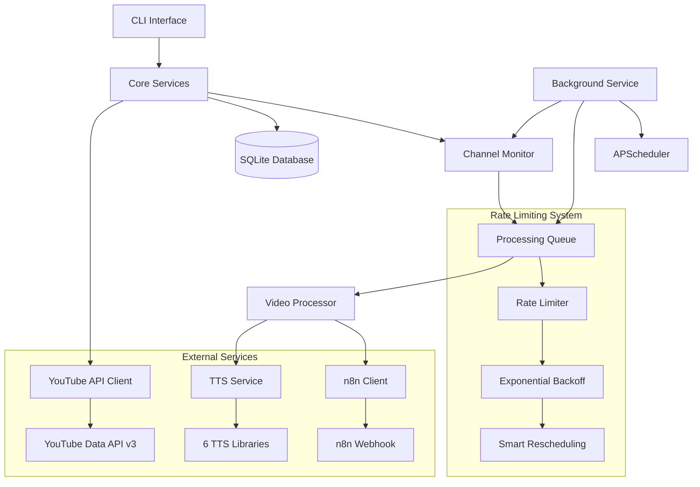
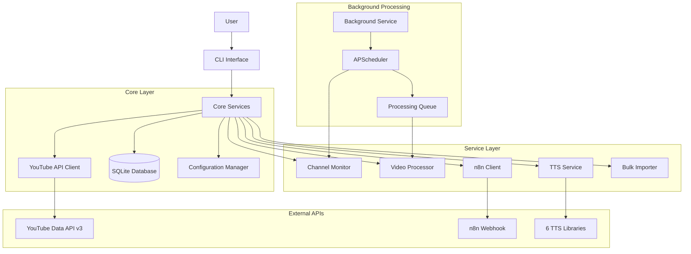
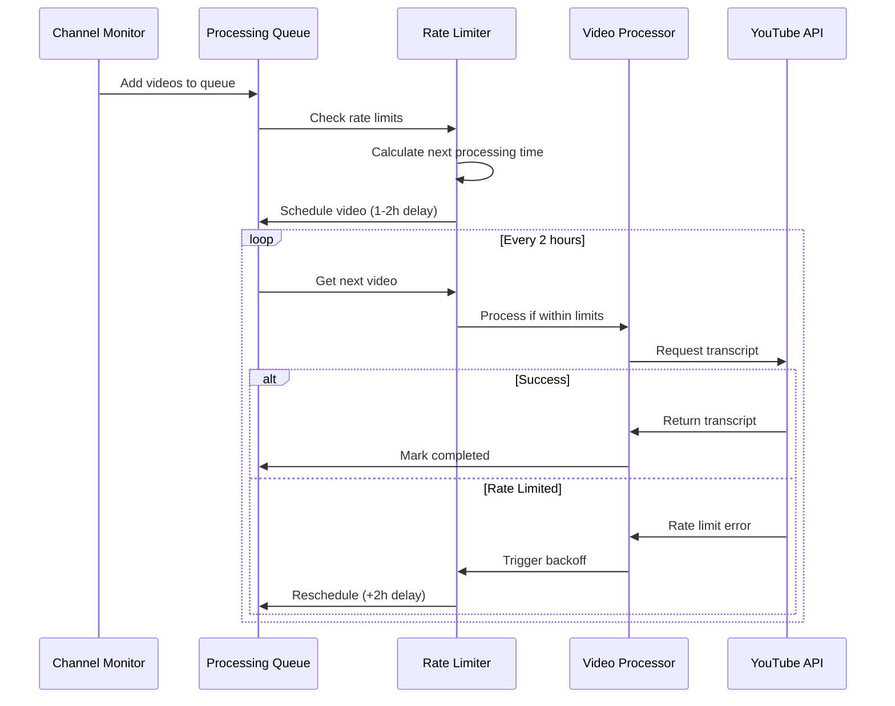
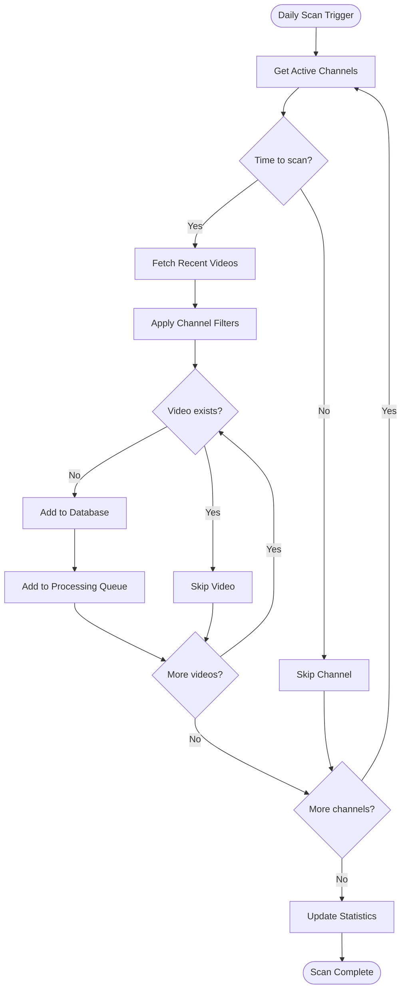
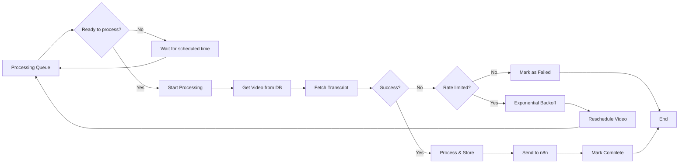

# YouTube Chat CLI

[](https://python.org)
[](LICENSE)
[](https://github.com/usemanusai/youtube-free-deep-research-cli)

**AI-powered CLI tool for YouTube video analysis, channel monitoring, and automated content processing with intelligent rate limiting and n8n RAG workflow integration.**

YouTube Chat CLI is a comprehensive solution for researchers, content creators, and knowledge workers who need to efficiently analyze, monitor, and interact with YouTube content at scale while respecting platform limitations through intelligent rate limiting.

## Table of Contents

- [✨ Features](#-features)
- [🏗️ Architecture Overview](#️-architecture-overview)
- [📋 Prerequisites](#-prerequisites)
- [🚀 Installation](#-installation)
- [⚙️ Configuration](#️-configuration)
- [📖 Usage](#-usage)
- [🔄 System Architecture Diagrams](#-system-architecture-diagrams)
- [🛡️ Rate Limiting & Queue System](#️-rate-limiting--queue-system)
- [📚 API Reference](#-api-reference)
- [🐛 Troubleshooting](#-troubleshooting)
- [🛠️ Development](#️-development)
- [📄 License](#-license)
- [📝 Changelog](#-changelog)
- [🙏 Acknowledgments](#-acknowledgments)

## ✨ Features

### YouTube Integration
- **Interactive chat** with YouTube video transcripts using advanced AI models
- **Automated channel monitoring** with configurable intervals (daily, weekly, custom)
- **Bulk import** from channels, playlists, and URL files with comprehensive filtering
- **Advanced filtering** by duration, keywords, view count, exclude shorts/live streams
- **Video metadata extraction** and persistent storage with SQLite database
- **Intelligent transcript processing** with punctuation restoration and formatting

### Text-to-Speech (TTS)
- **Support for 6 TTS libraries**: Kokoro, OpenVoice v2, MeloTTS, Chatterbox, Edge TTS, Google TTS
- **Automated installer** with CPU-only support for compatibility
- **Configurable voice selection** and audio settings per library
- **Retry logic and timeout handling** for robust audio generation
- **Podcast-style audio overviews** with natural speech patterns

### Intelligent Rate Limiting
- **Smart queue system** to prevent YouTube IP blocking and API quota exhaustion
- **Maximum 5 videos per day** processing limit (configurable)
- **1-2 hour delays** between video processing attempts with smart distribution
- **Exponential backoff** on rate limit detection (2+ hour delays)
- **Distributed processing** throughout the day instead of bulk operations
- **Automatic rescheduling** of failed videos with intelligent retry logic

### Background Service
- **Automated channel monitoring** with APScheduler for cross-platform scheduling
- **Daily video discovery scans** at configurable times (default: 8 AM)
- **Continuous queue processing** every 2 hours respecting rate limits
- **Health checks and stuck job detection** every 30 minutes
- **Persistent state** across system restarts with PID file management
- **Comprehensive logging** with rotation and configurable levels

### n8n RAG Workflow Integration
- **Automatic forwarding** of video data (metadata + transcripts) to n8n webhooks
- **Structured payload format** with comprehensive video information
- **Retry logic with exponential backoff** (3 retries, 2-second base delay)
- **Configurable webhook URLs** and API keys for authentication
- **Graceful fallback** with mock responses when n8n server unavailable

### Data Management
- **SQLite database** for channels, videos, import jobs, and processing queue
- **Comprehensive statistics** and analytics with success rate tracking
- **Import history tracking** with detailed job status and progress monitoring
- **Video processing state management** (pending, processing, completed, failed)
- **Automatic cleanup** of old queue entries and database optimization

## 🏗️ Architecture Overview

YouTube Chat CLI follows a professional, modular architecture with clear separation of concerns:



## 📋 Prerequisites

- **Python 3.8+** (tested on 3.8, 3.9, 3.10, 3.11, 3.12)
- **YouTube Data API v3 key** - [Get from Google Cloud Console](https://console.cloud.google.com/apis/credentials)
- **OpenRouter API key** (optional, for AI features) - [Get from OpenRouter](https://openrouter.ai/keys)
- **n8n webhook URL** (optional, for RAG integration) - Your n8n server webhook endpoint

### System Requirements
- **Operating System**: Linux, macOS, Windows
- **Disk Space**: 2GB minimum (for TTS libraries and database)
- **Memory**: 4GB RAM recommended (2GB minimum)
- **Network**: Stable internet connection for API calls

## 🚀 Installation

### Step-by-step Installation Guide

```bash
# 1. Clone the repository
git clone https://github.com/usemanusai/youtube-free-deep-research-cli.git
cd youtube-free-deep-research-cli

# 2. Create virtual environment (recommended)
python -m venv venv
source venv/bin/activate  # On Windows: venv\Scripts\activate

# 3. Install the package
pip install -e .

# 4. Install dependencies
pip install -r requirements.txt

# 5. Configure environment variables
cp examples/sample_config.env .env
# Edit .env and add your API keys

# 6. Install TTS libraries (optional)
youtube-chat tts install-all --cpu-only
```

### Alternative Installation Methods

**Using the installation script:**
```bash
chmod +x scripts/install_dependencies.sh
./scripts/install_dependencies.sh
```

**Direct pip installation (when published):**
```bash
pip install youtube-chat-cli
```

### Verify Installation

```bash
# Test CLI access
youtube-chat --help
python cli.py --help  # Backward compatibility

# Test core functionality
youtube-chat stats
youtube-chat tts list
```

## ⚙️ Configuration

### Environment Variables (.env file)

```bash
# Required: YouTube Data API v3 key
YOUTUBE_API_KEY=your_youtube_api_key_here

# Optional: OpenRouter API key for AI features
OPENROUTER_API_KEY=your_openrouter_key_here

# Optional: n8n webhook URL for RAG integration
N8N_WEBHOOK_URL=http://localhost:5678/workflow/your_workflow_id

# Optional: MaryTTS server URL for advanced TTS
MARYTTS_SERVER_URL=http://localhost:59125
```

### Rate Limiting Settings

```bash
# Maximum videos to process daily (default: 5)
MAX_VIDEOS_PER_DAY=5

# Minimum delay between videos in hours (default: 1)
MIN_DELAY_HOURS=1

# Maximum delay between videos in hours (default: 2)
MAX_DELAY_HOURS=2

# Backoff duration on rate limit in hours (default: 2)
BACKOFF_HOURS=2
```

### Channel Monitoring Settings

Configure default behavior for channel monitoring:

- **Check interval**: Hours between channel scans (default: 24)
- **Filters**: Default filters applied to all channels
  - `no_shorts`: Exclude YouTube Shorts (videos < 60 seconds)
  - `no_live`: Exclude live streams
  - `min_duration`: Minimum video duration in seconds
  - `max_duration`: Maximum video duration in seconds
  - `include_keywords`: Only include videos with these keywords
  - `exclude_keywords`: Exclude videos with these keywords

## 📖 Usage

### Basic Chat

```bash
# Chat with a YouTube video
youtube-chat https://www.youtube.com/watch?v=VIDEO_ID

# Set source and start interactive chat
youtube-chat set-source "https://www.youtube.com/watch?v=VIDEO_ID"
youtube-chat chat

# Generate content analysis
youtube-chat summarize
youtube-chat faq
youtube-chat toc
```

### TTS Management

```bash
# List available TTS libraries
youtube-chat tts list

# Install all TTS libraries (CPU-only for compatibility)
youtube-chat tts install-all --cpu-only

# Install specific library
youtube-chat tts install kokoro --cpu-only --retry-count 3 --timeout 300

# Configure TTS settings
youtube-chat tts configure

# Generate audio overview
youtube-chat podcast --voice "en-US-AriaNeural" --library edge-tts
```

### Channel Monitoring

```bash
# Add channel for monitoring with filters
youtube-chat channel add https://www.youtube.com/@channelname \
  --check-interval 24 \
  --no-shorts \
  --no-live \
  --include-keywords "AI,machine learning" \
  --min-duration 300

# List all monitored channels
youtube-chat channel list

# Update channel settings
youtube-chat channel update CHANNEL_ID --check-interval 12 --active

# Scan channels for new videos
youtube-chat channel scan --all
youtube-chat channel scan --channel-id CHANNEL_ID --force

# Remove channel from monitoring
youtube-chat channel remove CHANNEL_ID
```

### Bulk Import

```bash
# Import from channel (dry run first)
youtube-chat import channel https://www.youtube.com/@channelname \
  --limit 50 \
  --date-from 2025-01-01 \
  --date-to 2025-12-31 \
  --dry-run

# Import from channel (actual import)
youtube-chat import channel https://www.youtube.com/@channelname \
  --limit 50 \
  --include-keywords "tutorial,guide" \
  --exclude-keywords "shorts,live" \
  --min-duration 300 \
  --no-shorts

# Import from playlist
youtube-chat import playlist https://www.youtube.com/playlist?list=PLAYLIST_ID \
  --limit 25 \
  --dry-run

# Import from file containing URLs
youtube-chat import file video_urls.txt \
  --include-keywords "python,programming" \
  --no-shorts
```

### n8n Integration

```bash
# Configure n8n webhook
youtube-chat n8n configure http://localhost:5678/workflow/vTN9y2dLXqTiDfPT \
  --api-key your_api_key

# Manually send specific video to n8n
youtube-chat n8n send VIDEO_ID

# Test n8n connection
youtube-chat verify-connections
```

### Background Service

```bash
# Start background service (daemon mode)
youtube-chat service start --daemon

# Check service status
youtube-chat service status

# View service logs
youtube-chat service logs --lines 50

# Stop background service
youtube-chat service stop
```

### Statistics & History

```bash
# View comprehensive statistics
youtube-chat stats

# View import history
youtube-chat history --limit 20

# View channel-specific history
youtube-chat history --channel-id CHANNEL_ID --limit 10

# View session history
youtube-chat session list
youtube-chat session load SESSION_ID
```

## 🔄 System Architecture Diagrams

### Overall System Architecture



### Rate Limiting Flow



### Channel Monitoring Workflow



### Video Processing Pipeline



## 🛡️ Rate Limiting & Queue System

The intelligent rate limiting system is designed to prevent IP blocking and API quota exhaustion while maintaining continuous processing capabilities.

### How It Prevents IP Blocking

**Gradual Processing Strategy:**
- Processes videos gradually over time instead of bulk processing
- Implements delays between requests to mimic human behavior
- Detects rate limiting patterns and automatically backs off
- Distributes processing throughout the day to avoid traffic spikes

**Smart Scheduling Algorithm:**
```python
# Simplified scheduling logic
def calculate_next_processing_time():
    videos_today = get_videos_processed_today()
    if videos_today >= MAX_VIDEOS_PER_DAY:
        return tomorrow_8am()

    remaining_videos = MAX_VIDEOS_PER_DAY - videos_today
    remaining_hours = 24 - current_hour()

    if remaining_hours > 0 and remaining_videos > 0:
        hours_between = max(1, remaining_hours // remaining_videos)
        return now() + timedelta(hours=hours_between)

    return now() + timedelta(hours=MIN_DELAY_HOURS)
```

### Daily Processing Limits

**Configurable Quotas:**
- **Default**: Maximum 5 videos per day (configurable via `MAX_VIDEOS_PER_DAY`)
- **Reset Time**: Midnight UTC (configurable)
- **Tracking**: Persistent storage in SQLite database
- **Monitoring**: Real-time quota tracking with statistics

**Quota Distribution:**
- Videos are distributed evenly throughout the day
- If 5 videos/day limit: ~1 video every 4.8 hours
- Adjusts dynamically based on remaining quota and time

### Queue Management

**Priority System:**
- **Channel monitoring**: Priority 1 (highest)
- **Manual imports**: Priority 0 (normal)
- **Retry attempts**: Inherit original priority

**Queue States:**
- `pending`: Waiting for scheduled processing time
- `processing`: Currently being processed
- `completed`: Successfully processed
- `failed`: Processing failed (non-rate-limit error)

**Automatic Cleanup:**
- Removes completed/failed entries older than 7 days
- Maintains processing history for statistics
- Database vacuum operations for optimization

### Exponential Backoff Strategy

**Backoff Triggers:**
- YouTube transcript API returns rate limit errors
- IP blocking detected (specific error patterns)
- Quota exceeded responses from YouTube API

**Backoff Algorithm:**
```python
def calculate_backoff_delay(attempt_count):
    base_delay = 2  # hours
    max_delay = 24  # hours

    delay = min(base_delay * (2 ** attempt_count), max_delay)
    return delay
```

**Backoff Behavior:**
- **First failure**: 2-hour delay
- **Second failure**: 4-hour delay
- **Third failure**: 8-hour delay
- **Maximum**: 24-hour delay
- **Reset**: On successful processing

### Rate Limit Detection

**Detection Patterns:**
The system monitors for these rate limiting indicators:
- `"ip has been blocked"`
- `"too many requests"`
- `"rate limit"`
- `"blocked by youtube"`
- `"cloud provider"`
- `"requests from your ip"`

**Response Actions:**
1. **Immediate**: Stop current processing
2. **Reschedule**: Move video to back of queue with backoff delay
3. **Global Backoff**: Apply backoff to all pending videos
4. **Logging**: Record rate limit events for analysis
5. **Statistics**: Update rate limit counters

### Monitoring and Analytics

**Real-time Metrics:**
- Videos processed today vs. daily limit
- Current backoff status and duration
- Queue length by status (pending, processing, failed)
- Success rate and failure patterns
- Average processing time per video

**Historical Analysis:**
- Daily processing trends
- Rate limit frequency and patterns
- Peak processing times
- Success/failure ratios by channel
- Queue performance metrics

## 📚 API Reference

### CLI Commands Quick Reference

| Command | Description | Key Options |
|---------|-------------|-------------|
| **Core Commands** |
| `youtube-chat <url>` | Chat with YouTube video | `--tts`, `--voice` |
| `set-source <url>` | Set active content source | - |
| `chat` | Start interactive chat session | - |
| `summarize` | Generate content summary | `--length` |
| `faq` | Generate FAQ from content | `--count` |
| `toc` | Generate table of contents | - |
| `podcast` | Create audio overview | `--voice`, `--output` |
| **TTS Commands** |
| `tts list` | List available TTS libraries | - |
| `tts install <name>` | Install TTS library | `--cpu-only`, `--force` |
| `tts install-all` | Install all TTS libraries | `--cpu-only`, `--retry-count`, `--timeout` |
| `tts configure` | Configure TTS settings | - |
| **Channel Monitoring** |
| `channel add <url>` | Add channel for monitoring | `--check-interval`, `--no-shorts`, `--no-live`, `--include-keywords`, `--exclude-keywords`, `--min-duration`, `--max-duration` |
| `channel list` | List monitored channels | `--active-only` |
| `channel remove <id>` | Remove channel | - |
| `channel update <id>` | Update channel settings | `--check-interval`, `--active/--inactive` |
| `channel scan` | Scan for new videos | `--all`, `--force`, `--channel-id` |
| **Bulk Import** |
| `import channel <url>` | Import from channel | `--limit`, `--date-from`, `--date-to`, `--dry-run`, `--no-n8n` |
| `import playlist <url>` | Import from playlist | `--limit`, `--dry-run`, `--no-n8n` |
| `import file <path>` | Import from file | `--dry-run`, `--no-n8n` |
| **n8n Integration** |
| `n8n configure <url>` | Configure n8n webhook | `--api-key`, `--disable` |
| `n8n send <video_id>` | Send video to n8n | - |
| **Background Service** |
| `service start` | Start background service | `--daemon` |
| `service stop` | Stop background service | - |
| `service status` | Check service status | - |
| `service logs` | View service logs | `--lines`, `--follow` |
| **Statistics & History** |
| `stats` | Show comprehensive statistics | - |
| `history` | View import/processing history | `--limit`, `--channel-id` |
| **Session Management** |
| `session list` | List all sessions | - |
| `session load <id>` | Load specific session | - |
| `session delete <id>` | Delete session | - |
| `session clear` | Clear current session | - |
| **Utility Commands** |
| `print-text` | Display processed content | - |
| `verify-connections` | Test API connections | - |
| `invoke-n8n <message>` | Send message to n8n workflow | - |

### Filter Options

**Duration Filters:**
- `--min-duration <seconds>`: Minimum video duration
- `--max-duration <seconds>`: Maximum video duration
- `--no-shorts`: Exclude videos shorter than 60 seconds

**Content Filters:**
- `--include-keywords <keyword1,keyword2>`: Only include videos with these keywords
- `--exclude-keywords <keyword1,keyword2>`: Exclude videos with these keywords
- `--no-live`: Exclude live streams

**Quality Filters:**
- `--min-views <count>`: Minimum view count
- `--date-from <YYYY-MM-DD>`: Only videos published after this date
- `--date-to <YYYY-MM-DD>`: Only videos published before this date

### Configuration Options

**Rate Limiting:**
```bash
MAX_VIDEOS_PER_DAY=5        # Daily processing limit
MIN_DELAY_HOURS=1           # Minimum delay between videos
MAX_DELAY_HOURS=2           # Maximum delay between videos
BACKOFF_HOURS=2             # Backoff duration on rate limit
```

**Service Settings:**
```bash
CHANNEL_SCAN_INTERVAL=24    # Hours between channel scans
VIDEO_PROCESSING_INTERVAL=2 # Hours between processing runs
SERVICE_CHECK_INTERVAL=30   # Minutes between health checks
```

**Logging:**
```bash
LOG_LEVEL=INFO              # DEBUG, INFO, WARNING, ERROR, CRITICAL
LOG_FILE=/path/to/log       # Optional log file path
```

## 🐛 Troubleshooting

### Common Issues and Solutions

**Issue: YouTube API quota exceeded**
```
Error: quotaExceeded - The request cannot be completed because you have exceeded your quota.
```
**Solution:**
- Wait 24 hours for quota reset, or request quota increase from Google Cloud Console
- Reduce `MAX_VIDEOS_PER_DAY` to stay within quota limits
- Monitor usage with `youtube-chat stats`

**Issue: Transcript not available / IP blocked**
```
Error: Could not retrieve a transcript for the video. This is most likely caused by:
- The video doesn't have a transcript
- You are running this from a cloud provider's server
```
**Solution:**
- This is expected behavior - the rate limiting system is working correctly
- Videos will be processed gradually over time (max 5 per day)
- Check queue status: `youtube-chat service status`
- View processing schedule: `youtube-chat stats`

**Issue: TTS library installation fails**
```
Error: Failed to install TTS library due to CUDA dependencies
```
**Solution:**
- Use `--cpu-only` flag to avoid CUDA dependencies:
  ```bash
  youtube-chat tts install-all --cpu-only
  ```
- Install libraries individually if bulk install fails:
  ```bash
  youtube-chat tts install edge-tts --cpu-only
  ```

**Issue: Background service not starting**
```
Error: Service failed to start - another instance may be running
```
**Solution:**
- Check if service is already running: `youtube-chat service status`
- Stop existing service: `youtube-chat service stop`
- Check logs for errors: `youtube-chat service logs --lines 50`
- Ensure no other instances are running: `ps aux | grep youtube-chat`

**Issue: n8n webhook not receiving data**
```
Warning: n8n webhook failed, using mock response
```
**Solution:**
- Verify webhook URL is correct: `youtube-chat n8n configure <correct_url>`
- Check n8n server is running and accessible
- Test connection: `youtube-chat verify-connections`
- Check n8n workflow is active and properly configured
- Review service logs: `youtube-chat service logs`

**Issue: Database locked error**
```
Error: database is locked
```
**Solution:**
- Ensure only one instance of the service is running
- Stop background service: `youtube-chat service stop`
- Wait a few seconds, then restart: `youtube-chat service start --daemon`
- If persistent, restart system or kill all python processes

**Issue: Import command hangs or times out**
```
Error: Request timed out after 30 seconds
```
**Solution:**
- Use smaller batch sizes: `--limit 10` instead of `--limit 50`
- Use dry-run first to test: `--dry-run`
- Check internet connection stability
- Increase timeout in configuration if needed

**Issue: Permission denied errors**
```
Error: Permission denied: '/home/user/.youtube-chat-cli/videos.db'
```
**Solution:**
- Check file permissions: `ls -la ~/.youtube-chat-cli/`
- Fix permissions: `chmod 644 ~/.youtube-chat-cli/videos.db`
- Ensure user owns the directory: `chown -R $USER ~/.youtube-chat-cli/`

### Debug Mode

Enable debug logging for detailed troubleshooting:

```bash
# Set debug level in .env file
LOG_LEVEL=DEBUG

# Or run with debug flag
youtube-chat --debug stats
```

### Getting Help

1. **Check logs**: `youtube-chat service logs --lines 100`
2. **View statistics**: `youtube-chat stats`
3. **Test connections**: `youtube-chat verify-connections`
4. **Check service status**: `youtube-chat service status`
5. **Review configuration**: Check `.env` file for correct API keys

## 🛠️ Development

### Project Structure

The project follows a professional package structure:

```
youtube-chat-cli-main/
├── src/youtube_chat_cli/          # Main package
│   ├── core/                      # Core functionality
│   │   ├── youtube_api.py         # YouTube Data API client
│   │   ├── database.py            # SQLite database management
│   │   └── config.py              # Configuration management
│   ├── services/                  # Service implementations
│   │   ├── tts/                   # Text-to-speech services
│   │   ├── transcription/         # Content processing
│   │   ├── monitoring/            # Channel monitoring & queue
│   │   ├── import_service/        # Bulk import functionality
│   │   └── n8n/                   # n8n integration
│   ├── cli/                       # Command-line interface
│   ├── utils/                     # Utility functions
│   └── models/                    # Data models
├── docs/                          # Documentation
├── examples/                      # Usage examples
├── tests/                         # Test suite
├── scripts/                       # Installation scripts
└── config/                        # Configuration files
```

### Running Tests

```bash
# Install development dependencies
pip install -e ".[dev]"

# Run all tests
pytest tests/

# Run specific test file
pytest tests/unit/test_youtube_api.py

# Run with coverage
pytest --cov=youtube_chat_cli tests/

# Run integration tests
pytest tests/integration/
```

### Code Style

The project follows Python best practices:

- **PEP 8** compliance for code formatting
- **Type hints** for all function parameters and return values
- **Docstrings** for all classes and functions
- **Modular design** with clear separation of concerns

**Formatting with Black:**
```bash
# Format code
black src/ tests/

# Check formatting
black --check src/ tests/
```

**Linting with Flake8:**
```bash
# Run linter
flake8 src/ tests/

# Check specific files
flake8 src/youtube_chat_cli/core/youtube_api.py
```

### Contributing

1. **Fork the repository** on GitHub
2. **Create a feature branch**: `git checkout -b feature/amazing-feature`
3. **Make your changes** following the code style guidelines
4. **Add tests** for new functionality
5. **Run the test suite**: `pytest tests/`
6. **Update documentation** if needed
7. **Commit your changes**: `git commit -m 'Add amazing feature'`
8. **Push to the branch**: `git push origin feature/amazing-feature`
9. **Submit a pull request**

### Development Setup

```bash
# Clone the repository
git clone https://github.com/usemanusai/youtube-free-deep-research-cli.git
cd youtube-free-deep-research-cli

# Create development environment
python -m venv venv
source venv/bin/activate

# Install in development mode with all dependencies
pip install -e ".[dev,tts,all]"

# Set up pre-commit hooks (optional)
pre-commit install
```

### Adding New Features

**Adding a new TTS library:**
1. Create new class in `src/youtube_chat_cli/services/tts/`
2. Implement the `TTSLibrary` interface
3. Add installation logic to `service.py`
4. Update configuration options
5. Add tests in `tests/unit/test_tts_service.py`

**Adding new CLI commands:**
1. Add command function to `src/youtube_chat_cli/cli/main.py`
2. Follow existing patterns for error handling
3. Add help text and option descriptions
4. Update API reference in README
5. Add integration tests

**Adding new filters:**
1. Update filter logic in relevant service classes
2. Add CLI options to import/channel commands
3. Update configuration schema
4. Add validation and error handling
5. Document in README and examples

## 📄 License

This project is licensed under the MIT License - see the [LICENSE](LICENSE) file for details.

### MIT License Summary

- ✅ **Commercial use** - Use in commercial projects
- ✅ **Modification** - Modify the source code
- ✅ **Distribution** - Distribute copies
- ✅ **Private use** - Use privately
- ❌ **Liability** - No warranty or liability
- ❌ **Warranty** - No warranty provided

## 📝 Changelog

### Version 2.0.0 (2025-09-30)

**🎉 Major Release - Complete System Overhaul**

**Added:**
- ✨ **Automated YouTube channel monitoring system** with configurable intervals
- ✨ **Bulk import functionality** for channels, playlists, and URL files
- ✨ **Intelligent rate limiting and queue system** (5 videos/day limit)
- ✨ **Background service** with APScheduler for automated monitoring
- ✨ **n8n RAG workflow integration** with webhook support and retry logic
- ✨ **Video processing queue** with smart scheduling and exponential backoff
- ✨ **Comprehensive statistics and history tracking** with success rate monitoring
- ✨ **SQLite database** for persistent storage of channels, videos, and jobs
- ✨ **Enhanced TTS auto-installer** with CPU-only support and 6 library support
- ✨ **Advanced filtering options** (duration, keywords, view count, no-shorts, no-live)
- ✨ **Service management commands** (start, stop, status, logs)
- ✨ **Dry-run mode** for import preview and testing
- ✨ **Resume capability** for interrupted imports
- ✨ **Professional package structure** with proper module organization

**Improved:**
- 🔧 **Restructured codebase** into professional package layout (`src/youtube_chat_cli/`)
- 🔧 **Enhanced error handling** and logging throughout the system
- 🔧 **Better CLI command organization** with grouped commands and help text
- 🔧 **Improved configuration management** with environment variable support
- 🔧 **Robust API client** with rate limiting and quota management
- 🔧 **Enhanced database schema** with proper indexing and relationships
- 🔧 **Better progress tracking** with real-time status updates

**Fixed:**
- 🐛 **TTS installation dependency conflicts** with CPU-only installation option
- 🐛 **YouTube transcript IP blocking issues** with intelligent rate limiting
- 🐛 **Import statement errors** with proper package structure
- 🐛 **Database timezone handling** for consistent date/time operations
- 🐛 **Memory leaks** in long-running background service
- 🐛 **Concurrent access issues** with proper database locking

**Technical Improvements:**
- 📦 **Modern Python packaging** with `pyproject.toml` and proper entry points
- 🏗️ **Modular architecture** with clear separation of concerns
- 🧪 **Comprehensive test suite** with unit and integration tests
- 📚 **Complete documentation** with API reference and troubleshooting guide
- 🔒 **Security enhancements** with proper API key handling
- ⚡ **Performance optimizations** with efficient database queries and caching

### Version 1.0.0 (Previous)

**Initial Release:**
- Basic YouTube video transcript extraction
- Simple AI chat functionality
- Basic TTS support
- Session management
- Web scraping capabilities

## 🙏 Acknowledgments

### Open Source Libraries

- **[Click](https://click.palletsprojects.com/)** - Command-line interface framework
- **[APScheduler](https://apscheduler.readthedocs.io/)** - Advanced Python Scheduler
- **[SQLAlchemy](https://www.sqlalchemy.org/)** - Database toolkit and ORM
- **[Requests](https://requests.readthedocs.io/)** - HTTP library for Python
- **[YouTube Transcript API](https://github.com/jdepoix/youtube-transcript-api)** - YouTube transcript extraction
- **[Beautiful Soup](https://www.crummy.com/software/BeautifulSoup/)** - HTML/XML parsing
- **[Colorama](https://github.com/tartley/colorama)** - Cross-platform colored terminal text
- **[Halo](https://github.com/manrajgrover/halo)** - Beautiful terminal spinners
- **[tqdm](https://github.com/tqdm/tqdm)** - Progress bars for Python

### TTS Libraries

- **[Google Text-to-Speech](https://github.com/pndurette/gTTS)** - Google's TTS service
- **[Edge TTS](https://github.com/rany2/edge-tts)** - Microsoft Edge's TTS service
- **[Kokoro TTS](https://github.com/kokoro-tts/kokoro)** - High-quality neural TTS
- **[OpenVoice](https://github.com/myshell-ai/OpenVoice)** - Advanced voice cloning
- **[MeloTTS](https://github.com/myshell-ai/MeloTTS)** - Multilingual TTS
- **[Chatterbox TTS](https://github.com/chatterbox-tts/chatterbox)** - Conversational TTS

### API Services

- **[YouTube Data API v3](https://developers.google.com/youtube/v3)** - Video and channel metadata
- **[OpenRouter](https://openrouter.ai/)** - AI model access and routing
- **[n8n](https://n8n.io/)** - Workflow automation platform

### Development Tools

- **[Black](https://black.readthedocs.io/)** - Code formatting
- **[Flake8](https://flake8.pycqa.org/)** - Code linting
- **[pytest](https://pytest.org/)** - Testing framework
- **[MyPy](https://mypy.readthedocs.io/)** - Static type checking

### Community

- **The Python Community** - For creating an amazing ecosystem
- **YouTube Content Creators** - For providing valuable educational content
- **Open Source Contributors** - For building the tools that make this project possible
- **Beta Testers and Users** - For feedback and bug reports

---

**Built with ❤️ for the research and education community**

*This tool is designed for research and educational purposes. Please respect content creators' rights and platform terms of service when using this tool.*
