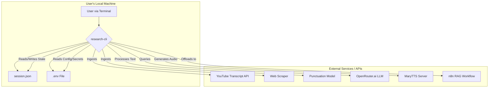

# Personal Research Insight CLI - Technical Architecture Document

## Document Information

*   **Version**: 1.0

*   **Date**: 2025-09-24

*   **Status**: Draft

*   **Prepared for**: Development Team Handoff

## Executive Summary

This document outlines the technical architecture for the Personal Research Insight CLI, a Python-based tool for personal research. The system is designed to be a lightweight, interactive command-line application that ingests web sources, processes text content, and leverages external services for AI-powered analysis (OpenRouter.ai), Text-to-Speech (MaryTTS), and advanced RAG capabilities (n8n). State and session context are persisted locally in a `session.json` file, ensuring a continuous user experience across multiple uses.

## System Overview

The architecture is a single CLI application written in Python. It operates by coordinating a series of modules to interact with local files and external, API-driven services. Its core function is to manage a local session, process text from URLs, and then use that text as context for various AI-driven commands.



## Technology Stack

The technology stack is selected to align with the core requirement of using free, open-source, and easily accessible tools for personal use.

| Component | Technology | Version / Details | Justification |
| --- | --- | --- | --- |
| **Language** | Python | 3.10+ | Robust, with excellent libraries for data processing, web requests, and CLI development. |
| **CLI Framework** | Click | 8.x | A powerful and composable library for creating clean and maintainable command-line interfaces. |
| **Data Ingestion** | `youtube-transcript-api` | Latest | Fetches YouTube transcripts efficiently without requiring API keys or browser automation. |
|  | `requests` + `BeautifulSoup4` | Latest | Standard libraries for making HTTP requests and parsing HTML from websites. |
| **Text Processing** | `deepmultilingualpunctuation` | Latest | Provides a powerful, local model for restoring punctuation to raw text, improving LLM input quality. |
| **LLM Interaction** | `langchain-huggingface` | Latest | Simplifies interaction with LLM APIs, including prompt management and history. |
| **LLM Provider** | OpenRouter.ai | API | Acts as a gateway to various free-tier LLMs, meeting the "free to use" requirement. |
| **TTS Service** | MaryTTS | Self-Hosted | An open-source, high-quality Text-to-Speech server accessible via a simple HTTP API. |
| **Configuration** | `python-dotenv` | Latest | Standard for managing environment variables from a `.env` file for secrets and endpoints. |
| **User Feedback** | `halo` | Latest | Provides user-friendly spinners and status indicators in the terminal. |

## Component Architecture

The CLI will be structured into several distinct Python modules, promoting separation of concerns and maintainability.

```mermaid
graph LR
    CLI[cli.py<br>(Click Commands)] --> SM[session_manager.py];
    CLI --> SP[source_processor.py];
    CLI --> LS[llm_service.py];
    CLI --> TS[tts_service.py];
    CLI --> NC[n8n_client.py];

    SP -- Uses --> LS;
```

*   **`cli.py`**: The main entry point. Defines the CLI commands (`summarize`, `chat`, `faq`, etc.) using the Click library. Orchestrates calls to other modules based on user input.

*   **`session_manager.py`**: Manages all interactions with the `session.json` file. Responsible for:
    *   Loading and saving the session state.
    *   Providing the persistent `session_id`. If one doesn't exist on first run, it generates and saves a UUID.
    *   Managing the `active_source_url` and `chat_history`.
    *   Handling session-related commands (e.g., `session view`, `session new-id`).

*   **`source_processor.py`**: Handles the ingestion and cleaning of text from URLs.
    *   Fetches transcripts from YouTube.
    *   Scrapes text content from websites.
    *   Runs the punctuation restoration model on the raw text.

*   **`llm_service.py`**: Manages all interactions with the OpenRouter.ai LLM.
    *   Constructs prompts using the context (processed text) and chat history.
    *   Sends requests to the LLM and returns the response.

*   **`tts_service.py`**: Handles the conversion of text to speech by making requests to the user's self-hosted MaryTTS server.

*   **`n8n_client.py`**: Responsible for sending the JSON payload to the n8n webhook for advanced processing.

## Data Architecture

### Local Session State (`session.json`)

A local file named `session.json` will be created in the user's home directory or a designated app data folder to persist state between CLI executions.

**Structure:**

```json
{
  "session_id": "a-persistent-uuid-for-n8n",
  "active_source_url": "https://www.youtube.com/watch?v=some_video",
  "chat_history": [
    {"role": "user", "content": "What is the main idea?"},
    {"role": "assistant", "content": "The main idea is..."}
  ]
}
```

### Configuration (`.env`)

A `.env` file in the project root will store configuration and secrets. A `.env.template` will be provided for setup.

**Structure:**

```bash
# API Key for OpenRouter.ai
OPENROUTER_API_KEY="your_api_key_here"

# URL for the self-hosted MaryTTS server
MARYTTS_SERVER_URL="http://localhost:59125"

# URL for the n8n RAG workflow webhook
N8N_WEBHOOK_URL="http://localhost:5678/workflow/vTN9y2dLXqTiDfPT"
```

## CLI Command Design

Based on your feedback, new commands will be included to manage the persistent session.

*   **Main Commands**: `summarize`, `faq`, `toc`, `chat`, `podcast`, `print-text`, `set-source`, `invoke-n8n`.

*   **Session Management Commands**:

    *   `research-cli session view`: Displays the current `session_id` and `active_source_url`.

    *   `research-cli session clear-history`: Clears the `chat_history` for the current source.

    *   `research-cli session clear-all`: Resets the `active_source_url` and `chat_history`.

    *   `research-cli session new-id`: Generates a new persistent `session_id` for n8n, overwriting the old one.
