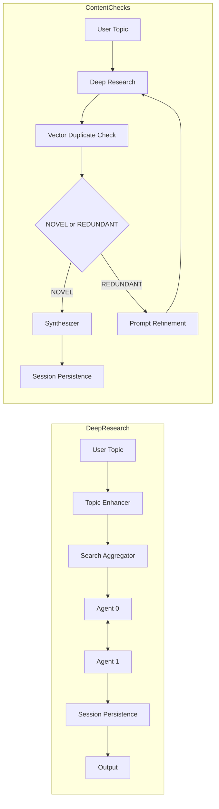

# Architecture Overview

## Workflows

## Components

- CLI / API → Workflows
- Workflows → Services (LLM, Search, Scraper, Vector Store)
- Services → Database (SQLite)
- BackgroundService → GDrive → Queue → Vector Store

