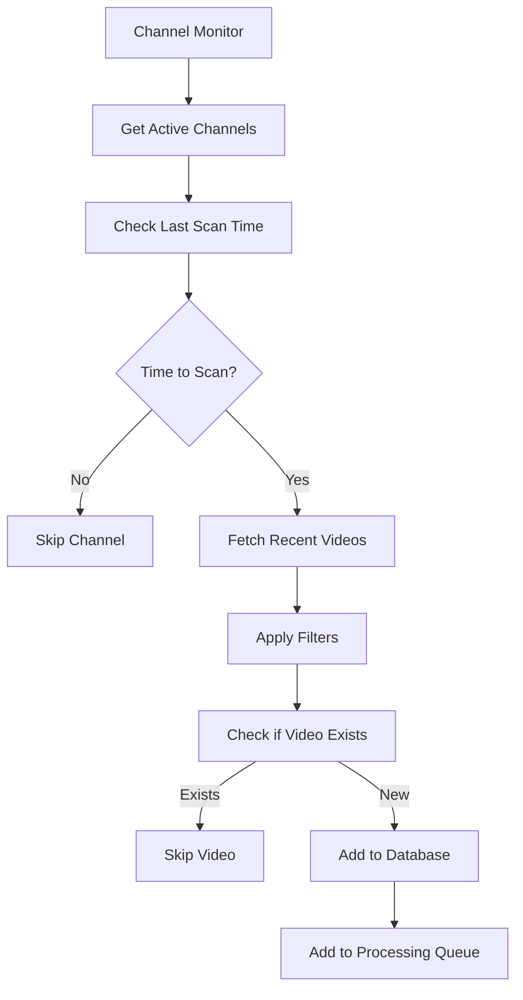
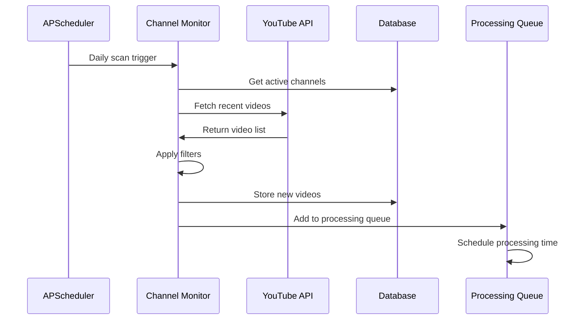
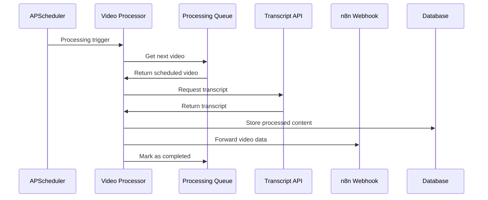

# System Architecture Overview

This document provides a comprehensive overview of the YouTube Chat CLI system architecture, design principles, and component interactions.

## Architecture Principles

### 1. Modular Design
- **Separation of Concerns**: Each module has a single, well-defined responsibility
- **Loose Coupling**: Components interact through well-defined interfaces
- **High Cohesion**: Related functionality is grouped together
- **Extensibility**: New features can be added without modifying existing code

### 2. Professional Package Structure
```
src/youtube_chat_cli/
├── core/                  # Fundamental components
├── services/              # Business logic and integrations
├── cli/                   # User interface layer
├── utils/                 # Shared utilities
└── models/                # Data structures
```

### 3. Layered Architecture
- **Presentation Layer**: CLI interface and user interactions
- **Service Layer**: Business logic and workflow orchestration
- **Integration Layer**: External API clients and data access
- **Data Layer**: Database operations and persistence

## Core Components

### 1. YouTube API Client (`core/youtube_api.py`)

**Responsibilities:**
- YouTube Data API v3 integration
- Video and channel metadata retrieval
- Rate limiting and quota management
- URL parsing and validation

**Key Features:**
- Automatic retry with exponential backoff
- Quota tracking and management
- Support for multiple URL formats
- Comprehensive error handling

**API Methods:**
```python
class YouTubeAPIClient:
    def get_video_details(video_ids: List[str]) -> List[YouTubeVideo]
    def get_channel_info(channel_id: str) -> YouTubeChannel
    def get_channel_videos(channel_id: str, limit: int) -> List[YouTubeVideo]
    def get_playlist_videos(playlist_id: str, limit: int) -> List[YouTubeVideo]
```

### 2. Database Manager (`core/database.py`)

**Responsibilities:**
- SQLite database operations
- Schema management and migrations
- Data persistence and retrieval
- Statistics and analytics

**Database Schema:**
```sql
-- Channels table
CREATE TABLE channels (
    id TEXT PRIMARY KEY,
    name TEXT NOT NULL,
    url TEXT NOT NULL,
    check_interval INTEGER DEFAULT 24,
    active BOOLEAN DEFAULT 1,
    filters TEXT,  -- JSON
    last_check TIMESTAMP,
    created_at TIMESTAMP DEFAULT CURRENT_TIMESTAMP
);

-- Videos table
CREATE TABLE videos (
    video_id TEXT PRIMARY KEY,
    channel_id TEXT,
    title TEXT NOT NULL,
    url TEXT NOT NULL,
    description TEXT,
    duration INTEGER,
    published_at TIMESTAMP,
    view_count INTEGER,
    status TEXT DEFAULT 'pending',
    transcript TEXT,
    metadata TEXT,  -- JSON
    created_at TIMESTAMP DEFAULT CURRENT_TIMESTAMP,
    processed_at TIMESTAMP
);

-- Processing queue table
CREATE TABLE processing_queue (
    id TEXT PRIMARY KEY,
    video_id TEXT NOT NULL,
    channel_id TEXT NOT NULL,
    priority INTEGER DEFAULT 0,
    status TEXT DEFAULT 'pending',
    scheduled_at TIMESTAMP,
    attempts INTEGER DEFAULT 0,
    last_attempt TIMESTAMP,
    error_message TEXT,
    created_at TIMESTAMP DEFAULT CURRENT_TIMESTAMP,
    processed_at TIMESTAMP
);
```

### 3. Configuration Manager (`core/config.py`)

**Responsibilities:**
- Environment variable management
- Configuration validation
- Default value handling
- API key management

**Configuration Sources:**
1. Environment variables (`.env` file)
2. Configuration files (`config/default_config.yaml`)
3. Command-line arguments
4. Default values

## Service Layer

### 1. Channel Monitor (`services/monitoring/channel_monitor.py`)

**Responsibilities:**
- Channel configuration management
- Video discovery and filtering
- Integration with processing queue
- n8n workflow integration

**Workflow:**


### 2. Video Processor (`services/monitoring/video_processor.py`)

**Responsibilities:**
- Video transcript extraction
- Content processing and formatting
- n8n data forwarding
- Error handling and retry logic

**Processing Pipeline:**
1. **Retrieve Video**: Get video details from database
2. **Extract Transcript**: Use YouTube Transcript API
3. **Process Content**: Clean and format transcript
4. **Store Results**: Update database with processed content
5. **Forward to n8n**: Send data to configured webhook
6. **Update Status**: Mark video as completed or failed

### 3. Processing Queue (`services/monitoring/video_queue.py`)

**Responsibilities:**
- Video processing scheduling
- Rate limiting enforcement
- Queue management and prioritization
- Backoff and retry logic

**Rate Limiting Algorithm:**
```python
def calculate_next_processing_time():
    videos_today = get_videos_processed_today()
    
    if videos_today >= MAX_VIDEOS_PER_DAY:
        return tomorrow_8am()
    
    remaining_videos = MAX_VIDEOS_PER_DAY - videos_today
    remaining_hours = 24 - current_hour()
    
    if remaining_hours > 0 and remaining_videos > 0:
        hours_between = max(1, remaining_hours // remaining_videos)
        return now() + timedelta(hours=hours_between)
    
    return now() + timedelta(hours=MIN_DELAY_HOURS)
```

### 4. Background Service (`services/monitoring/background_service.py`)

**Responsibilities:**
- Automated job scheduling
- Service lifecycle management
- Health monitoring
- Log management

**Scheduled Jobs:**
- **Channel Scanning**: Daily at 8 AM
- **Video Processing**: Every 2 hours
- **Health Checks**: Every 30 minutes
- **Database Cleanup**: Daily at midnight

### 5. TTS Service (`services/tts/service.py`)

**Responsibilities:**
- Text-to-speech library management
- Audio generation and processing
- Library installation and configuration
- Voice selection and settings

**Supported Libraries:**
- **Edge TTS**: Microsoft's cloud TTS service
- **Google TTS**: Google's cloud TTS service
- **Kokoro TTS**: High-quality neural TTS
- **OpenVoice v2**: Advanced voice cloning
- **MeloTTS**: Multilingual TTS
- **Chatterbox TTS**: Conversational TTS

## Integration Layer

### 1. n8n Client (`services/n8n/client.py`)

**Responsibilities:**
- Webhook communication
- Payload formatting
- Retry logic and error handling
- Authentication management

**Payload Structure:**
```json
{
    "video_id": "string",
    "title": "string",
    "description": "string",
    "url": "string",
    "channel_name": "string",
    "channel_id": "string",
    "duration": "integer",
    "published_at": "timestamp",
    "view_count": "integer",
    "transcript": "string",
    "metadata": "object",
    "processed_at": "timestamp"
}
```

### 2. Transcription Processor (`services/transcription/processor.py`)

**Responsibilities:**
- YouTube transcript extraction
- Web content scraping
- Content formatting and cleaning
- Punctuation restoration

**Processing Steps:**
1. **Extract Raw Transcript**: Use YouTube Transcript API
2. **Clean Content**: Remove timestamps and formatting
3. **Restore Punctuation**: Use deep learning models
4. **Format Text**: Apply consistent formatting
5. **Validate Quality**: Check transcript completeness

## Data Flow

### 1. Channel Monitoring Flow



### 2. Video Processing Flow



## Error Handling Strategy

### 1. Graceful Degradation
- **Service Failures**: Continue with reduced functionality
- **API Errors**: Retry with exponential backoff
- **Network Issues**: Queue operations for later retry
- **Database Errors**: Log and continue with next operation

### 2. Error Classification
- **Transient Errors**: Network timeouts, temporary API issues
- **Rate Limiting**: YouTube API quota or IP blocking
- **Permanent Errors**: Invalid video IDs, deleted content
- **Configuration Errors**: Missing API keys, invalid settings

### 3. Recovery Mechanisms
- **Automatic Retry**: For transient errors with backoff
- **Queue Rescheduling**: For rate-limited operations
- **Manual Intervention**: For configuration issues
- **Graceful Shutdown**: For critical system errors

## Performance Considerations

### 1. Database Optimization
- **Indexes**: On frequently queried columns
- **Connection Pooling**: Reuse database connections
- **Batch Operations**: Group related database operations
- **Regular Cleanup**: Remove old data automatically

### 2. Memory Management
- **Streaming Processing**: Process large datasets in chunks
- **Garbage Collection**: Explicit cleanup of large objects
- **Connection Limits**: Limit concurrent API connections
- **Cache Management**: LRU cache for frequently accessed data

### 3. Scalability
- **Horizontal Scaling**: Multiple service instances
- **Load Balancing**: Distribute processing across instances
- **Queue Partitioning**: Separate queues by priority
- **Database Sharding**: Split data across multiple databases

## Security Considerations

### 1. API Key Management
- **Environment Variables**: Store keys outside code
- **Key Rotation**: Support for key updates
- **Access Restrictions**: Limit API key permissions
- **Audit Logging**: Track API key usage

### 2. Data Protection
- **Encryption**: Encrypt sensitive data at rest
- **Access Control**: Limit database access
- **Input Validation**: Sanitize all user inputs
- **Output Encoding**: Prevent injection attacks

### 3. Network Security
- **HTTPS Only**: All external communications encrypted
- **Certificate Validation**: Verify SSL certificates
- **Rate Limiting**: Prevent abuse and DoS attacks
- **Firewall Rules**: Restrict network access

## Monitoring and Observability

### 1. Logging Strategy
- **Structured Logging**: JSON format for machine parsing
- **Log Levels**: DEBUG, INFO, WARNING, ERROR, CRITICAL
- **Log Rotation**: Prevent disk space issues
- **Centralized Logging**: Aggregate logs from all components

### 2. Metrics Collection
- **Performance Metrics**: Response times, throughput
- **Business Metrics**: Videos processed, success rates
- **System Metrics**: CPU, memory, disk usage
- **Error Metrics**: Error rates, failure patterns

### 3. Health Checks
- **Service Health**: Component availability and status
- **Database Health**: Connection and query performance
- **API Health**: External service availability
- **Queue Health**: Processing backlog and delays

## Future Enhancements

### 1. Scalability Improvements
- **Microservices Architecture**: Split into smaller services
- **Container Deployment**: Docker and Kubernetes support
- **Cloud Integration**: AWS, GCP, Azure deployment options
- **Auto-scaling**: Dynamic resource allocation

### 2. Feature Enhancements
- **Real-time Processing**: WebSocket-based updates
- **Advanced Analytics**: Machine learning insights
- **Multi-tenant Support**: Support multiple users/organizations
- **API Gateway**: RESTful API for external integrations

### 3. Operational Improvements
- **Monitoring Dashboard**: Web-based system monitoring
- **Automated Deployment**: CI/CD pipeline integration
- **Backup and Recovery**: Automated data backup
- **Performance Optimization**: Query optimization and caching
